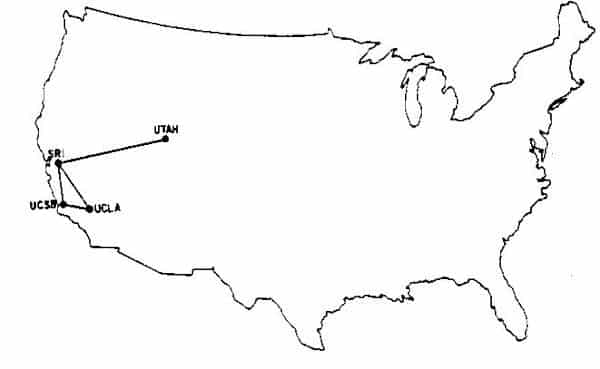

<!-- _paginate: false -->
# **Fundamentos de Informática e Aplicativos**

## Aula 6 - Interatividade e a Internet

---

## Interatividade

- *"Uma medida do potencial de habilidade de uma mídia permitir que o usuário exerça influência sobre o conteúdo ou a forma da comunicação mediada."*
- Uma das mídias que possui grande interatividade é a **Internet**

---

## Internet

- Sistema global de redes de computadores interligadas que utilizam um conjunto próprio de *protocolos* (TCP/IP) com o propósito de servir usuários do mundo inteiro
- Protocolo: *"Conjunto de regras"* que possibilita a conexão, comunicação e transferência de dados entre dois sistemas computacionais
- Uma mensagem (texto, áudio, vídeo, etc.), ao ser enviada pela Internet, é divida em pacotes, cada um rotulado com o endereço de origem e destino (como uma carta)

---

## Internet

- Cada pacote por sua vez é encaminhado através de múltiplos computadores até chegar o destino final
- TCP (Transmission Control Protocol): Faz o empacotamento e remontagem da mensagem
- IP (Internet Protocol): Cuida do endereçamento e do encaminhamento dos pacotes

---

## História da Internet (Anos 60)

- Foi criada a ARPANET, o embrião da Internet como conhecemos hoje. Possuia quatro nós: SRI (Stanford Research Institute), UCLA (University of California in Los Angeles), UCSB (University of California in Santa Barbara) e UTAH (University of Utah) e eram interligados via linha telefônica

---

## História da Internet (Anos 70)

- Aumento da quantidade de nós da rede, surgimento dos protocolos TCP/IP e dos serviços de e-mail, telnet e FTP (File Transfer Protocol)

---

## História da Internet (Anos 80)

- Abertura da ARPANET para pessoas físicas
- Aumento da quantidade de nós da rede (excede 100.000)
- O Mosaico da NCSA torna-se o primeiro navegador (browser)

---

## História da Internet (Anos 90)

- Nascia a WWW (World Wide Web)
- A internet fica com cerca de 10 milhões de servidores on-line e aproximadamente 40 milhões de pessoas usando em 150 países

---

## História da Internet (Anos 2000)

- Em 2007, mais do que 97% de todas as informações telecomunicadas foi realizada através da internet

---

## Internet para Atividades do Dia a Dia

- Pesquisar por um site
- Envio de e-mail
- Compartilhar um arquivo

---

## Pesquisar por um Site

- Informar na barra de endereços um buscador (`www.google.com`)

---

## Pesquisar por um Site

- Informar no buscador o assunto a ser pesquisado (carros esportivos)

---

## Envio de E-mail

- Informar o site de envio de e-mails (`www.gmail.com`)
- Informar a conta no qual deseja utilizar o serviço (se não já não tiver uma conta, crie uma)
- Informar a senha da sua conta

---

## Envio de E-mail

- Para enviar um e-mail, clicar no botão **Escrever**

---

## Envio de E-mail

- No campo **Para**, escrever o endereço do destinatário do e-mail
- No campo **Assunto**, escrever qual é o assunto do e-mail
- Para enviar uma cópia do e-mail, clicar em **Cc** (em vermelho)
- Para enviar uma cópia do e-mail, mas manter os destinatários ocultos, clicar em **Cco** (em vermelho)
- Para anexar algum arquivo, clicar no **clipe** (em vermelho)
- Após o campo **Assunto** escrever a mensagem que você que enviar
- Ao terminar de elaborar o e-mail, clicar no botão **Enviar**

---

## Envio de E-mail

---

## Envio de E-mail

- Exemplo de envio (destinatário: fulano@gmail.com)

---

## Compartilhar um Arquivo

- Acessar o Google Drive (`drive.google.com`)

---

## Compartilhar um Arquivo

- Arrastar o arquivo (`fia-slides-aula5.pdf`) para o Google Drive

---

## Compartilhar um Arquivo

- Escolher o acesso **Qualquer pessoa com o link** (em vermelho)

---

## Compartilhar um Arquivo

- Escolher a função **Leitor** (em vermelho)

---

## Compartilhar um Arquivo

- Clicar em **Copiar link** e enviá-lo (em vermelho)

---

## Compartilhar um Arquivo

- Para mais funcionalidades, clicar nas **três bolinhas** (em vermelho)

---

## Referências Bibliográficas

- Wikipedia; Interatividade, https://pt.wikipedia.org/wiki/Interatividade, acessado em 27/03/2023
- Fernades, Carlos; História da Internet, http://cecead.com/assuntos/disciplinas/redes-de-computadores/aula-01-redes-de-computadores/, acessado em 27/03/2023
- Wikipedia, Internet, https://pt.wikipedia.org/wiki/Internet, acessado em 27/03/2023

---

## Referências Bibliográficas

- Wikipedia, Protocolo, https://pt.wikipedia.org/wiki/Protocolo_(ci%C3%AAncia_da_computa%C3%A7%C3%A3o), acessado em 27/03/2023
- Olhar Digital, "Mãe da internet", ARPANET completa 52 anos; conheça sua história", https://img.olhardigital.com.br/wp-content/uploads/2019/10/20191024161532.jpg, acessado em 23/03/2023
- Capron, H. L., J. A. Johnson, "Introdução à Informática", 8ª edição, Pearson Prentice Hall, 2004

---

## Referências Bibliográficas

- The Conversation, "How the Internet was born: from the ARPANET to the Internet", https://theconversation.com/how-the-internet-was-born-from-the-arpanet-to-the-internet-68072, acessado em 23/07/2023
