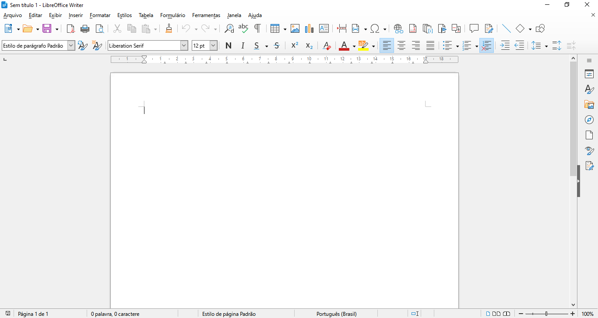
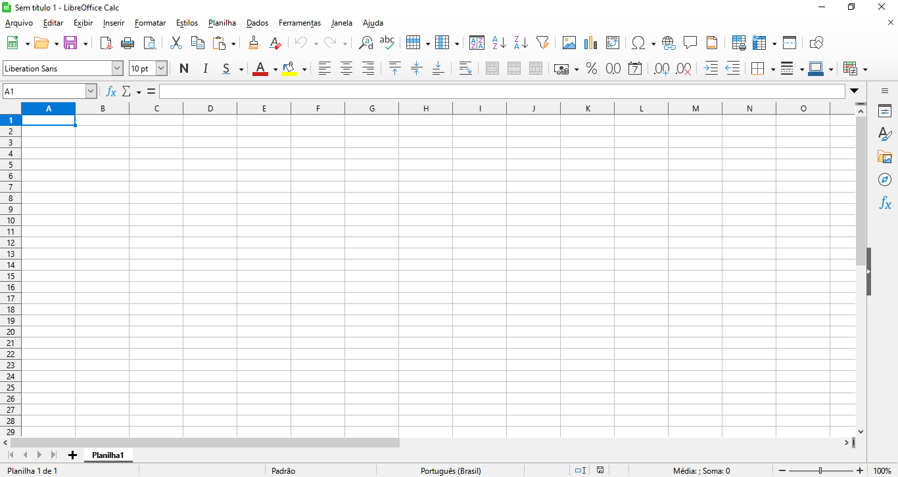
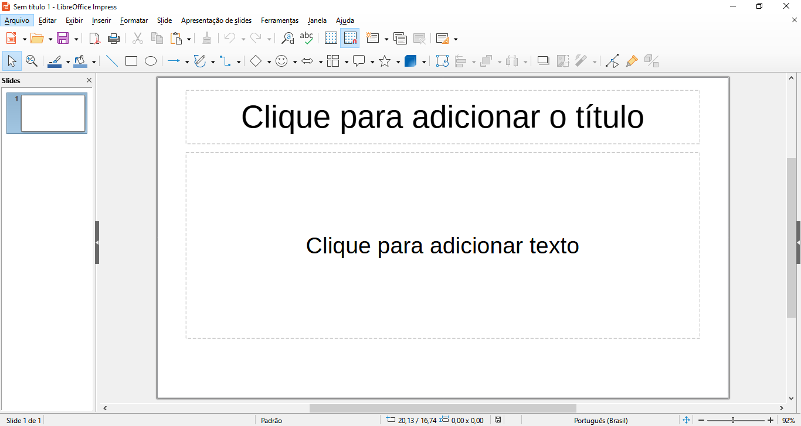

<!-- _paginate: false -->
# **Fundamentos de Informática e Aplicativos**

## Aula 7 - Processador de Texto, Planilha Eletrônica e Apresentação Eletrônica

---

## LibreOffice

- É uma suíte de aplicativos para escritório disponível para Windows, Unix, Solaris, Linux e macOS
- Compatível com o Microsoft Office
- Utiliza o formato OpenDocument (ISO/IEC 26300 e NBR ISO/IEC 26300)
- Site oficial do projeto: https://www.libreoffice.org/

---

## Aplicativos do LibreOffice

- Writer
  - Processador de textos
- Calc
  - Planilha eletrônica
- Impress
  - Editor de apresentação eletrônica

---

## Aplicativos do LibreOffice

- Draw
  - Editor de gráficos vetoriais e diagramas de fluxo
- Base
  - Banco de dados
- Math
  - Editor de fórmulas

---

## LibreOffice Writer

---

## LibreOffice Calc

---

## LibreOffice Impress

---

## Referências Bibliográficas

- Wikipedia, "LibreOffice", https://pt.wikipedia.org/wiki/LibreOffice, acessado em 04/04/2023
- LibreOffice, https://www.libreoffice.org/, acessado em 04/04/2023
- LibreOffice, "Livros do LibreOffice em Português", https://documentation.libreoffice.org/pt-br/portugues/, acessado em 04/04/2023