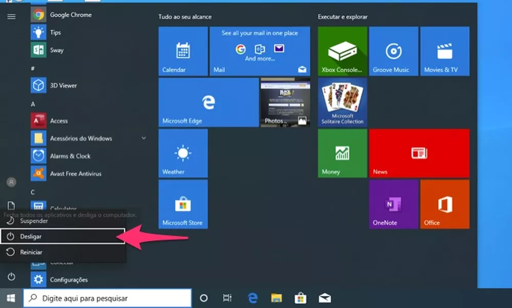
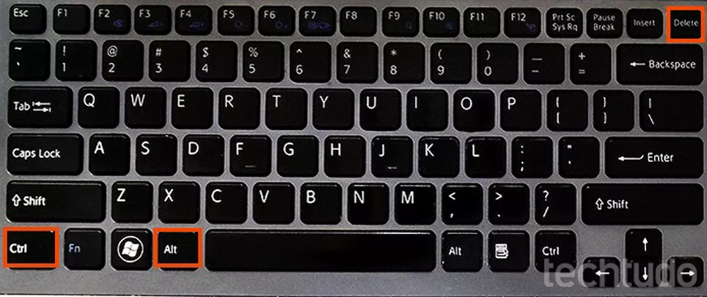
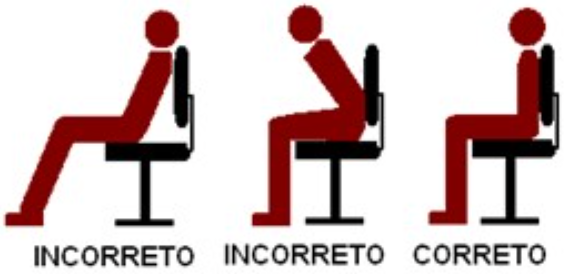
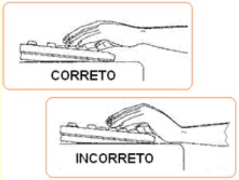

<!-- _paginate: false -->
# **Fundamentos de Informática e Aplicativos**

## Capítulo 2 - Conhecendo as Operações do Computador e Cuidados ao Usá-lo

---

## Conhecendo as Operações do Computador

- Ler a apostila "Informática Básica para o Estudo On-line", desenvolvida pelo IF Goiás e escrita por Wilsovelton Teles de Jesus e Milton Ferreira de Azara Filho

---

## Cuidados Essenciais: Desligando o PC

- Selecione o menu Iniciar, botão Desligar, opção Desligar

---

## Cuidados Essenciais: Desligando o PC

- Combinação de teclas "Ctrl + Alt + Del"
- Botão Desligar, opção Desligar

---

## Cuidados Essenciais

- **Faça backups regulares**
- Atualize o sistema operacional e aplicações
- Tenha um bom antivirus instalado e atualizado
- Não baixe arquivos e programas que você não conhece
- Reserve uma pasta para arquivos frequentes na área de trabalho
- Mantenha o HD limpo

---

## Cuidados Essenciais

- Limpe-o corretamente
- Cuidado com os líquidos
- Cuidado com superaquecimento (ventilação)
- Organizar os cabos

---

## Postura ao Sentar em Frente ao Computador

---

## Postura ao Teclado

---

## Referências Bibliográficas

- MANZANO, Maria Izabel N.G. **Estudo Dirigido de Informática Básica**. 7ª. Edição. Ed. Érica, 2011. ISBN: 978-85-365-0128-4
- Panorama Positivo. **Computador para trabalho: 7 cuidados essenciais para se ter**. https://www.meupositivo.com.br/panoramapositivo/computador-para-trabalho/, acessado em 27/02/2023
- Techtudo, **Sete cuidados que você deveria ter com o seu PC**. https://www.techtudo.com.br/listas/2022/04/sete-cuidados-que-voce-deveria-comecar-a-ter-com-seu-pc.ghtml, acessado em 27/02/2023

---

## Referências Bibliográficas

- Techtudo, **Como desligar o PC pelo teclado**. https://www.techtudo.com.br/dicas-e-tutoriais/2020/01/como-desligar-o-pc-pelo-teclado.ghtml, acessado em 27/02/2023
- Juliana Portales, **Operação do Computador**. https://slideplayer.com.br/slide/1231909/, acessado em 27/03/2023
- De Jesus, W. T, Filho, M. F. de A. **Informática Básica para o Estudo On-line**. https://ifg.edu.br/attachments/article/19169/Inform%C3%A1tica%20b%C3%A1sica%20para%20o%20estudo%20on-line%20(19-12-2020).pdf
