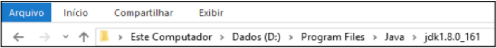

<table>
    <tr>
        <td>
            
        </td>
        <td>
IFPE – Instituto Federal de Pernambuco | Ensino a Distância 
Curso: Manutenção e Suporte em Informática 
Professor: Fabrício Cabral <fabricio.cabral@ead.ifpe.edu.br> 
Disciplina: Fundamentos de Informática e Aplicativos 
Atividade: Lista de Exercícios nº 03
        </td>
    </tr>
</table>

# Lista de Exercícios 03 – Windows Explorer (Explorador de Arquivos)

1. (IBFC / EMDEC-2016) O aplicativo da Microsoft Windows responsável para a cópia, exclusão, organização, movimentação e todas as atividades de gerenciamento de arquivos é o:
   a) Windows Movie Maker
   b) Windows Defender
   c) Windows Media Player
   d) Windows Explorer
   e) Nenhum dos anteriores
2. (CESGRANRIO - Escriturário/Agente Comercial 2021) Um usuário precisa utilizar o Explorador de Arquivos do Windows 10 para listar, pelo menos, os atributos de nome e data e hora de modificação dos arquivos e das subpastas, contidos em uma pasta. Para apresentar esses atributos, depois de selecionar a pasta desejada no Explorador de Arquivos, o usuário deve selecionar a opção de exibição
   a) ícones grandes
   b) ícones médios
   c) ícones pequenos
   d) detalhes
   e) lista
3. (IMBEL - FGV 2021) No Windows, o usuário de nome Fulano criou uma pasta denominada Seguros no seu desktop, na qual armazenou arquivos variados. No contexto do aplicativo Explorador de Arquivos do Windows, assinale o endereço que corresponde à referida pasta.
   a) C:\Users\Fulano\Desktop\Seguros
   b) C:\Fulano\Desktop\Seguros
   c) C:\Desktop\Fulano\Seguros
   d) C:\Users\Fulano\Seguros
   e) C:\Fulano\Seguros
4. (2013, FEPESE / JUCESC - Analista Técnico em Gestão de Registro Mercantil - Técnico em Atividades Administrativas - Adaptado) A função da tecla F2, ao ser pressionada sobre um arquivo ou pasta, do Windows Explorer do MS Windows 10 professional em português, é:
   a) Compactar o arquivo ou pasta.
   b) Criptografar o arquivo ou pasta.
   c) Editar o nome do arquivo ou pasta.
   d) Enviar o arquivo ou pasta para a lixeira.
   e) Abrir o arquivo ou pasta, utilizando o aplicativo padrão designado para tal.
5. (Polícia Militar) Considerando a configuração padrão do mouse, o duplo-clique no botão esquerdo sobre um arquivo no Windows Explorer:
   a) Abre o arquivo no aplicativo associado
   b) Apaga o arquivo
   c) Imprime o arquivo
   d) Cria um atalho no Desktop
   e) Move o arquivo para a Nuvem
6. (FGV - 2019 - Prefeitura de Salvador - BA - Guarda Civil Municipal) Observe a figura a seguir extraída do Explorador de Arquivos (Windows Explorer) do MS Windows 10 BR.

    

Nesse contexto, um clique sobre a pequena seta para cima fará com que o Explorador de Arquivos
   a) mostre o conteúdo da última pasta visitada.
   b) mostre o conteúdo da pasta "Java".
   c) abra uma lista dos locais recentes.
   d) mostre o conteúdo da pasta "Dados (D:)".
   e) faça o upload do conteúdo da pasta atual para a nuvem.

7. A tecla de atalho para abrir o Explorador de Arquivos (Windows Explorer) no Windows 10 BR é:
   a) Tecla Windows + A
   b) Tecla Windows + W
   c) Tecla Windows + E
   d) Tecla Windows + D
   e) Tecla Windows + R
8. (SEDF/CESPE/2017/Técnico - Adaptado) A respeito dos conceitos de organização, de segurança e de gerenciamento de informações, arquivos, pastas e programas, julgue o item a seguir.
No Explorador de Arquivos do Windows 10, ao se clicar uma pasta com o botão direito do mouse, selecionar a opção Propriedades e depois clicar a aba Segurança, serão mostradas algumas opções de permissões para usuários autorizados como, por exemplo, Controle total, Modificar e Leitura.
9. (IMBEL/FGV/2021) Bruno quer copiar para um *pen drive* todo o conteúdo de uma pasta localizada no *desktop* do seu computador, mas antes precisa descobrir quantas subpastas e arquivos há na referida pasta e, também, o espaço requerido para a armazenagem. Assinale o recurso do Windows que permite mais facilmente a obtenção dessas informações.
   a) Configurações.
   b) Bloco de Notas.
   c) Prompt de Comando.
   d) Gerenciador de Tarefas.
   e) Explorador de Arquivos.
10. (IMBEL/FGV/2021) Maria abriu o *Explorador de Arquivos* no Windows para apagar um arquivo em uma certa pasta. Depois de acessar a pasta, Maria localizou o arquivo, selecionou-o e pressionou Delete no teclado. Maria, imediatamente, percebeu que havia deleteado o arquivo errado. Ato contínuo, usou uma combinação de teclas e o arquivo voltou a ser exibido na lista. Assinale a combinação de teclas utilizada por Maria.
   a) Ctrl-Alt-X
   b) Ctrl-Alt-D
   c) Ctrl-R
   d) Ctrl-Y
   e) Ctrl-Z