

<!-- _paginate: false -->
# **Fundamentos de Informática e Aplicativos**

## Capítulo 1 - Um Breve Resumo da História dos Computadores

---

# Ábaco (5.500 a.c.)

- Instrumento mais antigo para realizar cálculos aritméticos
- Foi descoberto por arqueólogos na Babilônia. Teve origem provavelmente na Mesopotâmia.

---

## Ossos de Napier (1614)

- John Napier (1550-1617) foi um matemático escocês que desenvolveu os logaritmos
- Bastões usados para dividir, multiplicar e elevar raízes mecanicamente

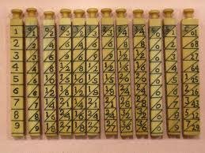

---

## Régua de Cálculo (1622)

- Inventada pelo matemático William Oughtred (1574 - 1660)
- Dispositivo de cálculo que se baseia na sobreposição de escalas logarítimicas

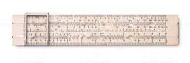 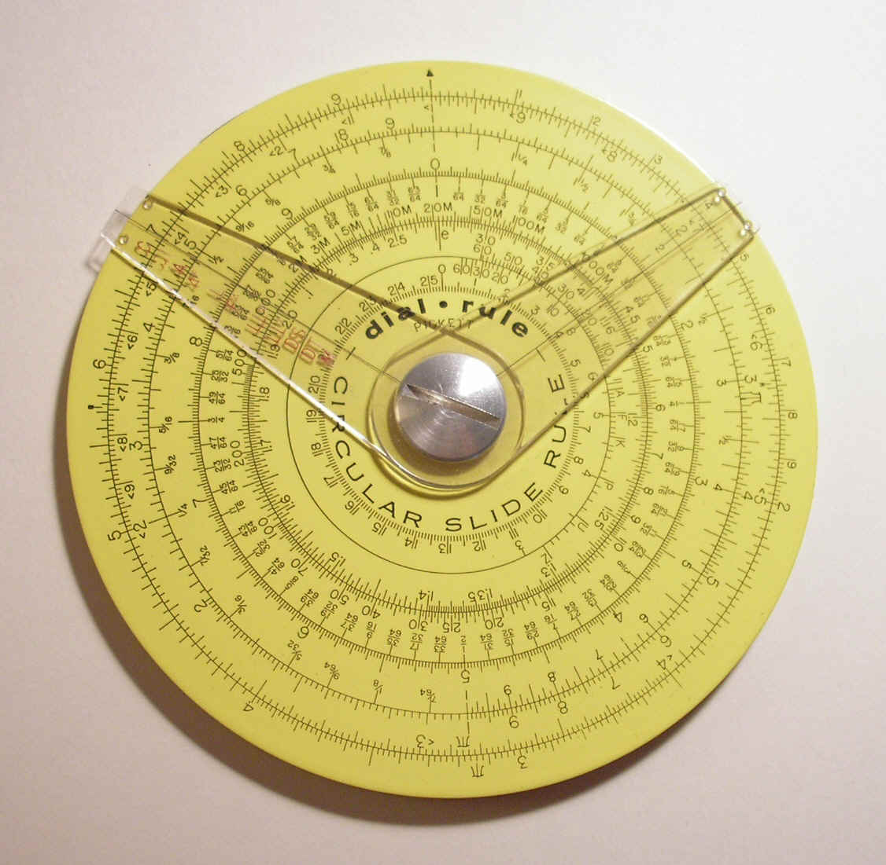

---

## Máquina de Schickard (1623)

- Inventada pelo professor de hebraico e astronomia Wilhelm Schickard (1592 - 1635)
- Máquina que efetuava adições, subtrações, multiplicações e divisões

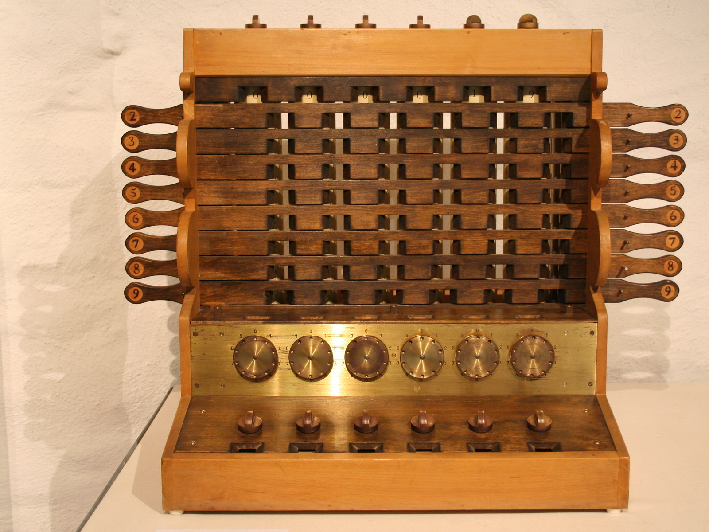

---

## La Pascaline (1642)

- Inventada pelo matemático, escritor, físico e inventor Blaise Pascal (1623 - 1662)
- Primeira calculadora mecânica do mundo
- Fazia as quatro operações básicas

---

## Máquina de Leibniz (1672)

- Inventada pelo matemático e filósofo Gottfried Wilhelm Leibniz (1646 - 1716)
- Baseada na Pascaline, mas além das quatro operações básicas, era possível extrair a raiz quadrada

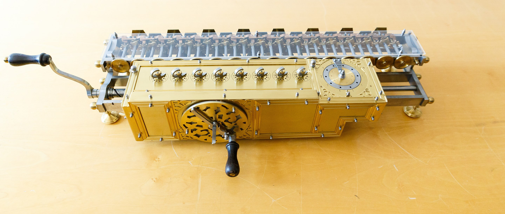

---

## Tear de Jacquard (1801)

- Desenvolvido pelo mecânico e inventor francês Joseph-Marie Jacquard (1752 - 1834)
- Tear inteiramente automático, capaz de ler uma série de cartões perfurados e executar as operações na sequência correta

---

## Tear de Jacquard (1801)

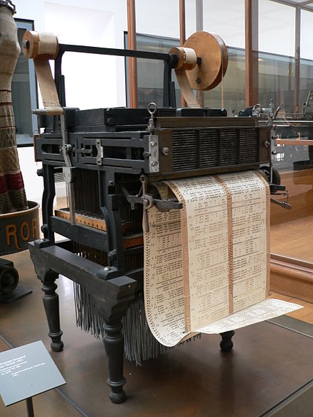

---

## Máquina Diferencial (1822)

- Inventada pelo matemático britânico Charles Babbage (1792 - 1871),
- Máquina para resolver equações polinômicas e efetuar os cálculos para construir tabelas de logarítimos
- Era capaz de receber dados, processá-los, armazená-los e exibi-los
- Benefícios
  - Primeira tentativa de máquina automática e adaptável
  - Imprimia os resultados em cartões perfurados
  - Foi um dos pontos de partida para a indústria de máquinas
---

## Máquina Diferencial (1822)

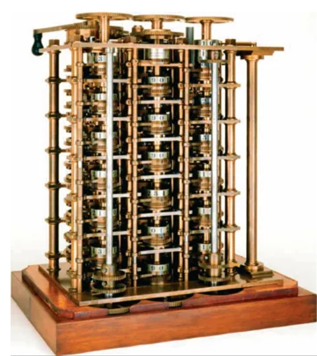

---

## Máquina Analítica (1837)

- Projetada para realizar qualquer operação matemática e ter possibilidade de ser programada usando cartões perfurados
- Incorporava uma Unidade Lógica Aritmética (ULA), fluxo de controle, loops e memória integrada
- Por seus dois projetos, Babbage ficou conhecido como o **Pai da Computação**

---

## [Parte da] Máquina Analítica (1837)

---

## Augusta Ada Byron King (1815 - 1852)

- Atualmente conhecida como Ada Lovelace
- Desenvolveu os algoritmos que permitiriam à máquina analítica de Babbage computar os valores de funções matemáticas e publicou uma coleção de notas que estabeleceram a base para a programação de computador
  - Por esse trabalho ficou conhecida como a **Primeira Programadora**
- Criou o conceito de **sub-rotina** (sequência de instruções que pode ser usada várias vezes) em programas de computador

---

## Augusta Ada Byron King (1815 - 1852)

---

## Máquina de Calcular Baldwin (1872)

- Inventada por Frank Stephen Baldwin (1838 - 1925)
- Máquina capaz de calcular as quatro operações sem conversão para quaisquer dos processos
- Substitui os cilindros das máquinas de Leibniz e Thomas por único cilindro que movimentaria um número variável de dentes (1 por 9) de acordo com o movimento de uma alavanca fixada

---

## Máquina de Calcular Baldwin (1872)

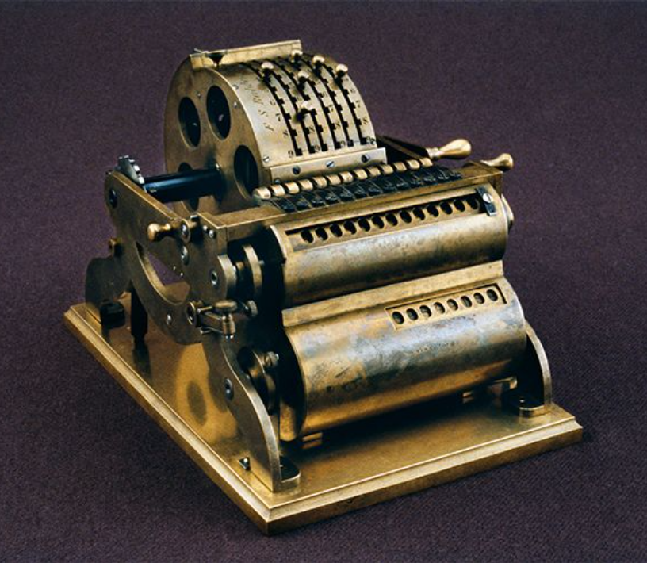

---

## George Boole (1815 - 1864)

- Criador da lógica matemática e da Álgebra Booleana, fundamental para o desenvolvimento da computação moderna

---

## Máquina de Tabular (1880)

- Criada por Herman Hollerith (1860 - 1929)
- Diminuiu a contagem e divulgação do cálculo populacional pelo censo norte-americano de sete para dois anos e meio
- Fomou uma companhia para produzir uma série de máquinas melhoradas que incorporaram outras duas máquinas: o Tabulador e o Perfurador de Cartões

---

## Máquina de Tabular (1880)

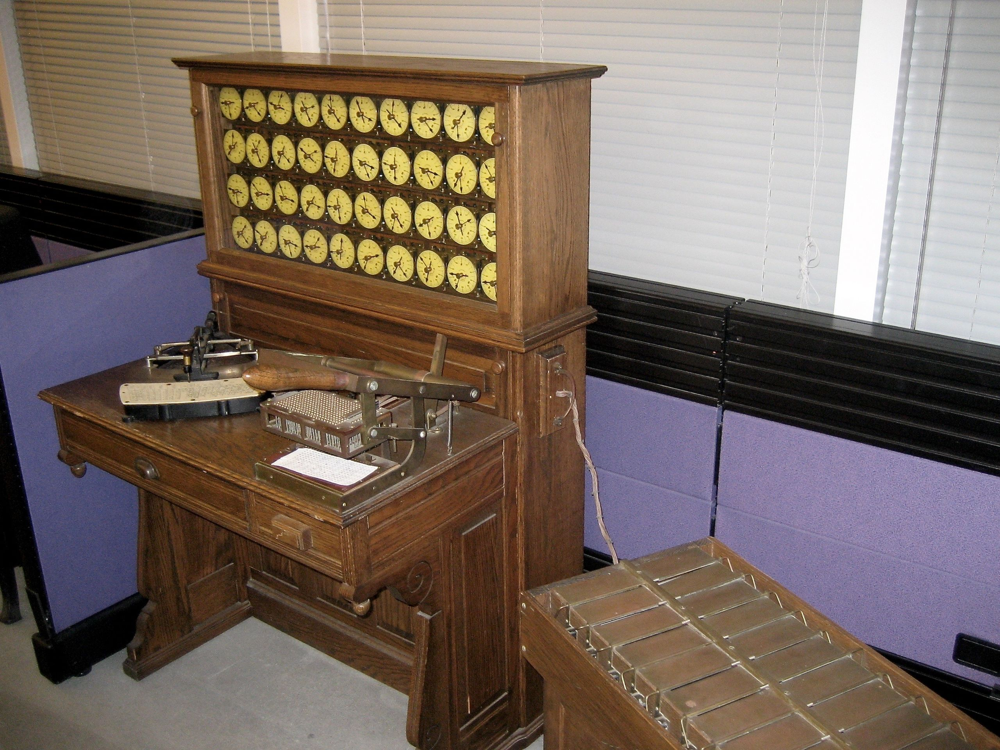 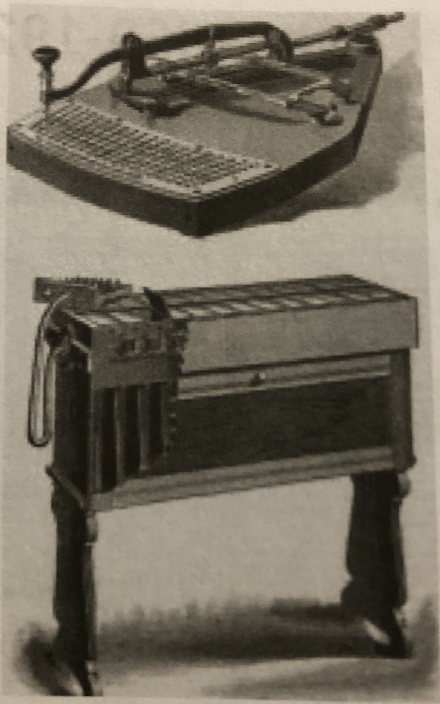

---

## Computômetro (1887)

- Criado por Dorr Eugene Felt (1862 - 1920)
- Primeira calculadora em que números eram registrados apertando chaves em vez de serem girados como roldanas ou catracas

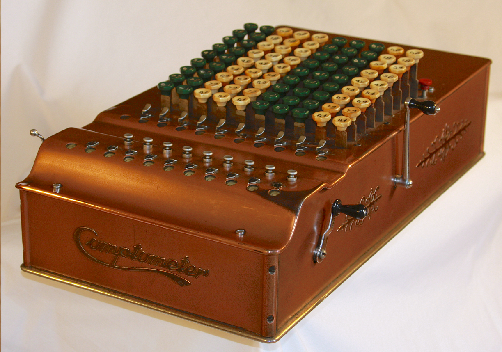

---

## Máquina de Odhner ou Arithmometer (1905)

- Criada por Willgodt T. Odhner (1845 - 1905)
- Incorporava um mecanismo de "roda de alfinete" (uma espécie de alavanca levemente saltada), cujo encaixe se dava no local do número desejado
- Foi uma das calculadoras mecânicas mais populares do mundo

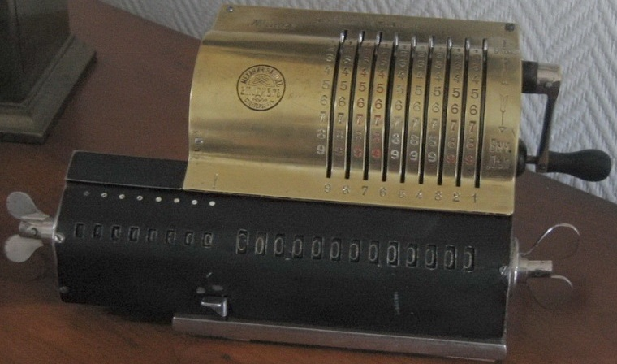

---

## Mark I (1944)

- Projeto de Howard H. Aiken (1900 - 1972) adaptado pela IBM
- Foi a primeira calculadora eletro-mecânica automática produzida em larga escala desenvolvida nos Estados Unidos
- Usado apelas para cálculos numéricos, pesava cinco toneladas, utilizou 765 mil componentes eletromecânicos, 500 milhas de fio, oito válvulas e 66 fitas de papel
  - Registrava 150 palavras de memória de revezamento
  - Armazenava um total de 20.000 palavras
- Era capaz de completar seis meses de cálculo manual em um dia

---

## Mark I (1944)

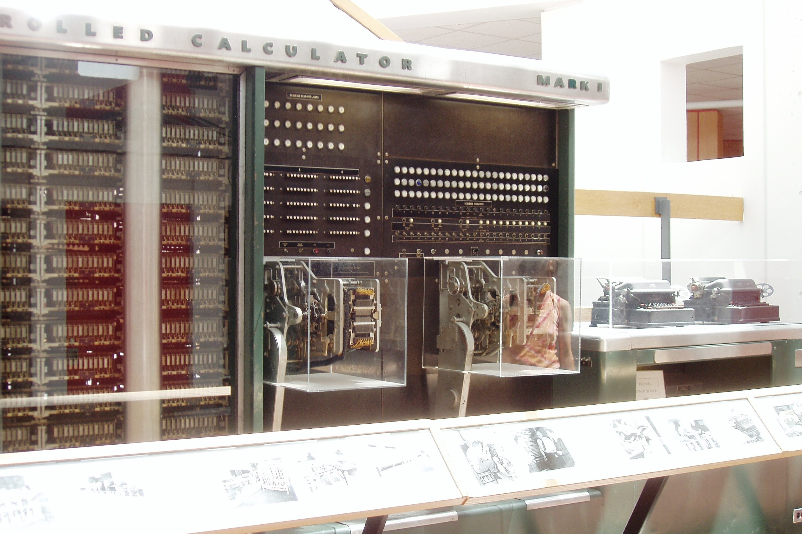

---

## John Louis von Neumann (1903 - 1957)

- Idealizou a "Arquitetura de von Neumann", que se caracteriza pela possibilidade de uma máquina digital armazenar seus programas no mesmo espaço de memória que os dados
- A máquina proposta por Von Neumann reúne os seguintes componentes:
  - Uma memória
  - Uma Unidade Lógica e Aritmética (ULA)
  - Uma Unidade de Controle (CU)

---

## John Louis von Neumann (1903 - 1957)

 

---

## Z1 (1938), Z2 (1939), Z3 (1941), Z4 (1950) e Z5 (1952)

- Konrad Zuse (1910 - 1995) desenvolveu a série "Z" de computadores a base de relés

---

## Z1 (1938)

- Primeira máquina binária programável do mundo
- Não era eletrônica, mas podia ser controlada por meio de uma fita perfurada que levaria instruções a serem executadas

---

## Z2 (1939)

- Primeiro computador do mundo
- Evolução do Z1, pois trabalhava com relés (2.600) e válvulas
- Pesava cerca de 1 tonelada e consumia 4.000 watts

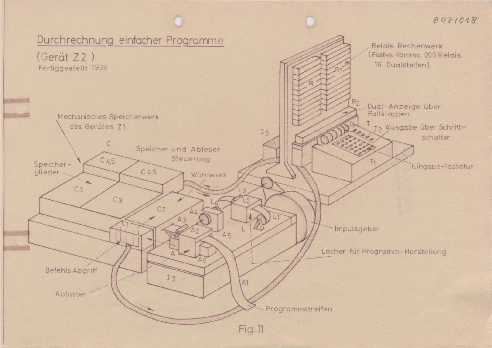

---

## Z3 (1941)

- Foi o primeiro computador programável, automático e digital do mundo
- Possuia 2.600 relés e o código de programa era armazenado em filme perfurado

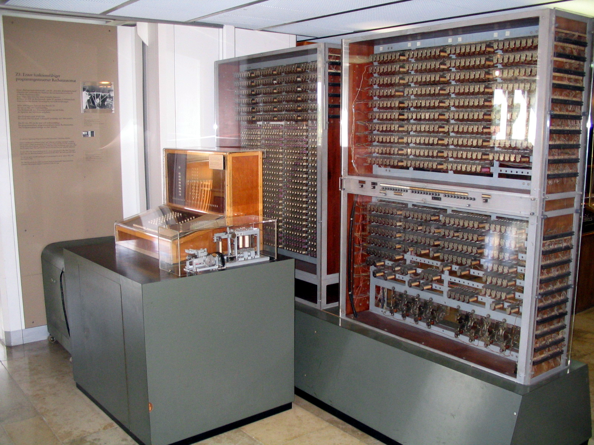

---

## Z4 (1950)

- Essencialmente o mesmo computador que o Z2
- Comparado com o Z3, teve um aumento na capacidade de efetuar cálculos, inclusive científicos complicados
- Podia efetuar 1.000 instruções por hora

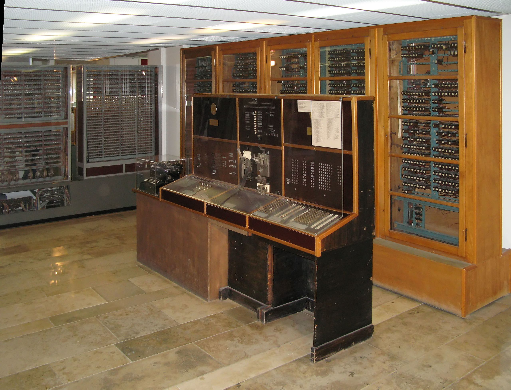

---

## Z5 (1952)

- Ocupava uma área de dez metros de comprimento por quatro metros e meio de largura
- Utilizou 2.800 relés modernos utilizados em telefonia, mais confiáveis que os tubos de vácuo

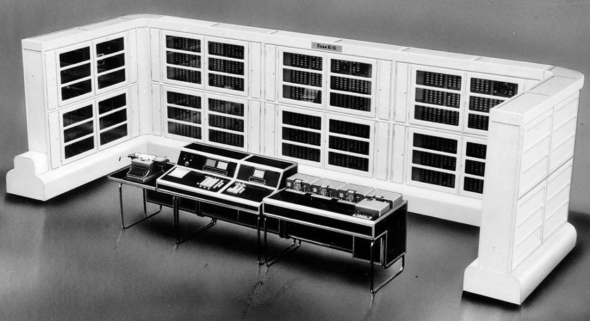

---

## Alan Turing (1912 - 1954)

- Criador da Ciência da Computação, do conceito de software e da Inteligência Artificial
- Desenvolveu uma máquina hipotética (Máquina de Turing) que seria dependente de procedimentos lógicos bem definidos, semelhante a um "idioma" que reproduzisse os estados da mente humana
- O conceito de máquina de Turing se tornou a fundação da teoria moderna da computação

---

## Alan Turing (1912 - 1954)

---

## ENIAC I (1946)

- Concebido por John Presper Eckert (1919 - 1995) e John Mauchly (1907 - 1980)
- O *Electrical Numerical Integrator And Computer* (ENIAC) foi o primeiro computador digital eletrônico
- Ocupava 167 metros quadrados de área, a altura de um edifício de três andares, 17.468 válvulas, 70.000 resistores, 10.000 capacitores, 1.500 relés, 6.000 interruptores manuais e 5 milhões de junções soldadas, pesando 20 toneladas e consumia 160 kW
- Grande parte dos seus conceitos ainda é usada na indústria de computação eletrônica moderna

---

## ENIAC I (1946)

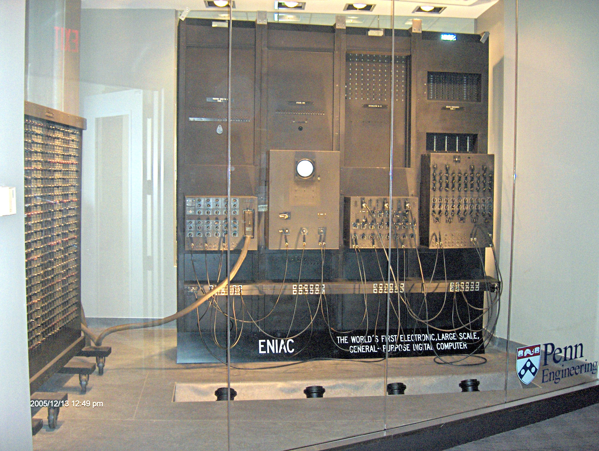

---

## Claude Shannon (1916 - 2001)

- Engenheiro e fundador da **Teoria da Informação**, diz que a informação está sempre presente quando um sinal é transmitido de um lugar a outro
- Todas as formas de informação podem ser tratadas por computadores; o que importa é que a informação possa ser transmitida quantas vezes se desejar
- O armazenamento, a combinação, a comparação de mensagens e transmissão chamamos de processamento da informação

---

## Claude Shannon (1916 - 2001)

---

## As Gerações dos Equipamentos

- Primeira Geração - Válvulas (1927 a 1952)
- Segunda Geração - Transistores (1954 - 1962)
- Terceira Geração - Circuitos Integrados (1962 - 1972)
- Quarta Geração - VLSI (Integração em Larga Escala) (1972 - 1984)

---

## Primeira Geração - Válvulas (1927 a 1952)

- Eram de difícil manutenção e consumiam grande quantidade de energia
- As válvulas eram bem frágeis, queimavam como lâmpadas e superaqueciam
- Nessa geração, a programação era em linguagem de máquina

---

## Segunda Geração - Transistores (1954 - 1962)

- Criado em 1947 por três cientistas da Bell Telephone Company
- Eram menores, mais baratos, rápidos e resistentes que as válvulas
- A linguagem de programação na época era o ASSEMBLY

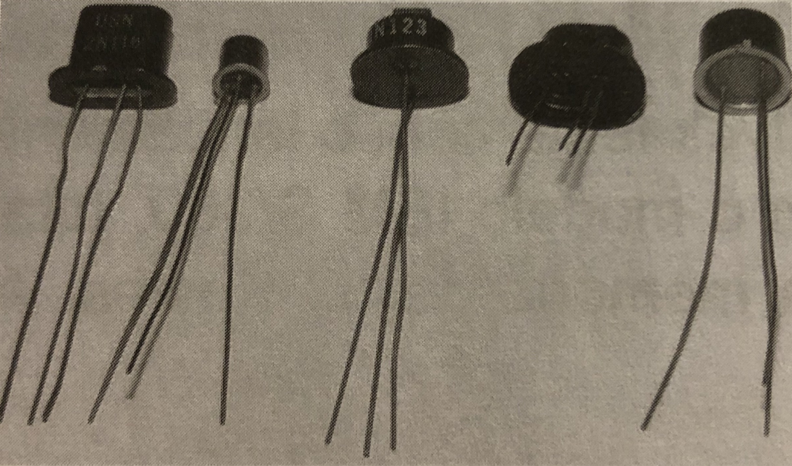

---

## Terceira Geração - Circuitos Integrados (1962 - 1972)

- Um Circuito Integrado (CI) é um circuito eletrônico miniaturizado (composto principalmente por dispositivos semicondutores) sobre um substrato fino de material semicondutor
- O computador IBM S/360 possuia CIs que eram do tamanho de um grão de arroz

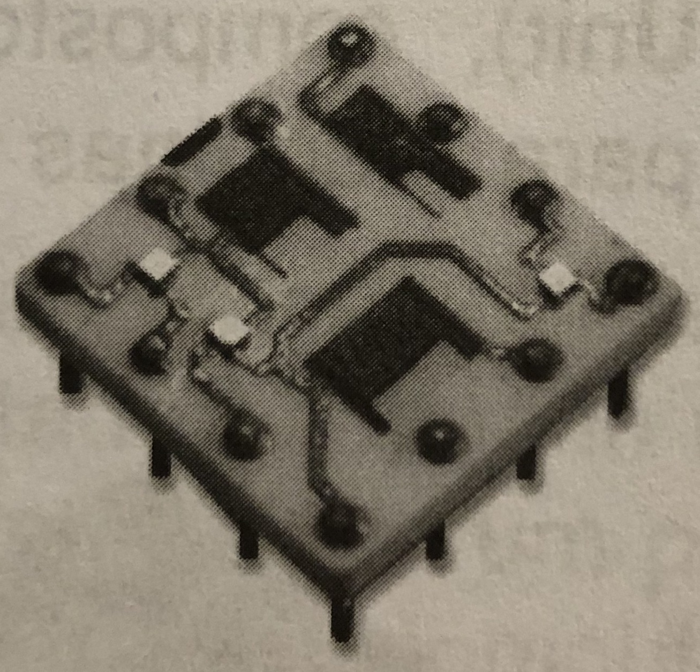

---

## Quarta Geração - VLSI (Integração em Larga Escala) (1972 - 1984)

- Devido a essa tecnologia surgem computadores menores, mais rápidos e com grande capacidade de memória
- Se comparado, seria possível substituir milhões de transistores por um único chip semicondutor
- Era o padrão de microcircuitos da IBM

---

## Cronograma da Evolução da Microinformática

- A partir da década de 70 começa a história da microinformática, considerada uma atividade de "entusiastas" por eletrônica

---

## Ano: 1971

- A Intel lança o processador 4004, que fez parte ad primeira era das CPU (Central Processing Unit)
- Processador de 4 bits, desenvolvido para máquinas calculadoras
- Possuia 46 instruções

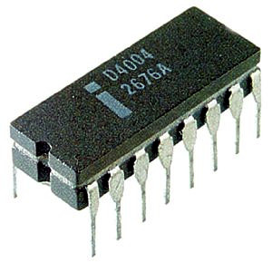

---

## Ano: 1974

- A Radio-Eletronics lança o microcomputador Mark-8, baseado no microprocessador Intel 8008 (primeiro microprocessador de 8 bits do mundo)
- Possuia 256 bytes de memória RAM (Random-Access Memory)
- O Mark-8 é o primeiro computador pessoal comercializado

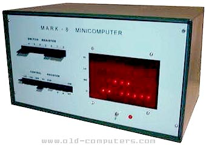

---

## Ano: 1975

- A MITS (Micro Instrumentation Telemetry Systems) lança o MITS Altair 8800, primeiro microcomputador baseado na CPU Intel 8080
- Tinha 256 bytes de memória RAM, painel de controle frontal com luzes e interruptores, terminal de computador binário, 22 caracteres, conector de fita K7, etc.

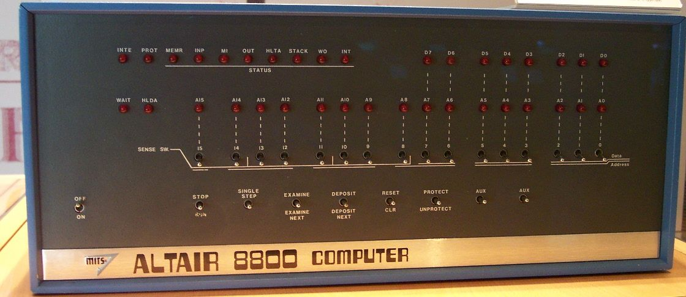

---

## Ano: 1976

- Steve Jobs e Steve Wozniak desenvolveram o microcomputador Apple I no porão de casa
- O Apple I foi o primeiro computador popular residencial e foi um fracasso

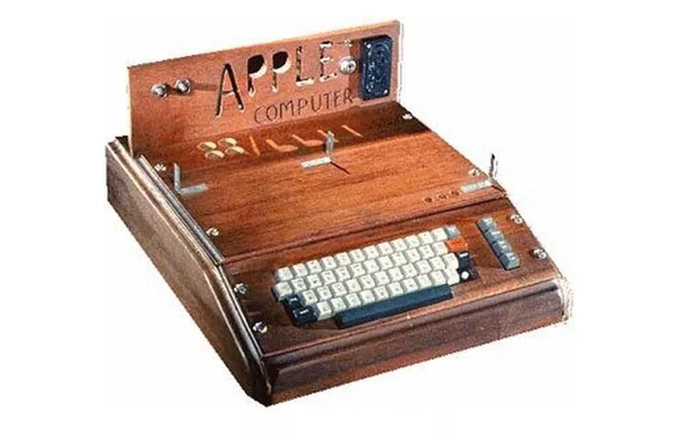

---

## Ano: 1977

- A Apple Computer Corp. lança o Apple II, um sucesso no mercado de microcomputadores
- O Apple II passa a ter monitor, teclado, 16 KiB de RAM e 16 KiB de ROM (Read-Only Memory)

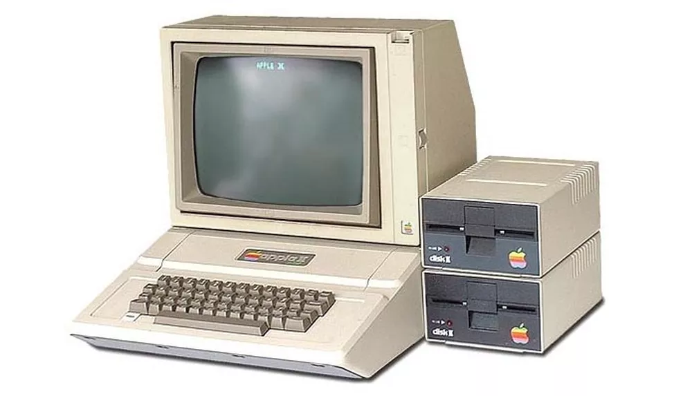

---

## Ano: 1978

- A Apple Computer Corp. deixa a garagem e muda-se para Cupertino, Califórnia, EUA
- Continuaram inovando com o disquete para Apple II e lançaram sucessivos sucessos

---

## Ano: 1979

- Intel lança o microprocessador 8088, processador de 8 bits mas com 16 bits de endereçamento de memória RAM
- Lançado o WordStar, um editor de textos, que viria a ser o primeiro software de aplicação popular. Em seguida vieram o dBase para administração de dados e o VisiCalc para planilhas eletrônicas de cálculo
- A IBM iniciou o desenvolvimento do primeiro PC (Personal Computer), que teria arquitetura aberta, mas necessitava de dois softwares: linguagem de computador e Sistema Operacional

---

## Ano: 1979

 

---

## Ano: 1980

- A IBM procura a Microsoft de Bill Gates e Paul Allen, que era a maior empresa distribuidora de linguagem de computador, mas não tinha um sistema operacional
- A Microsoft contacta a Seattle Computer Products que havia criado o Sistema Operacional QDOS e o compra por US$ 50,000, licenciando-o por US$ 50,00 por PC

---

## Ano: 1980

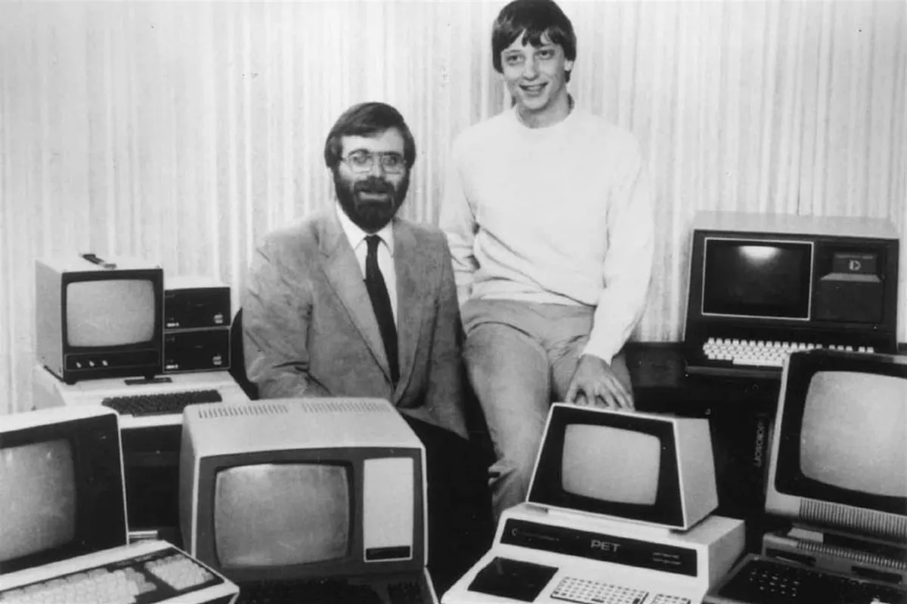

---

## Ano: 1981

- A IBM anuncia seu IBM-PC, baseado no microprocessador Intel 8086 de 4.77 MHz e com um drive de disquete com 160 KB de armazenagem
- Como o IBM-PC era de arquitetura aberta, todos os fabricantes de equipamentos queriam fabricar computadores PCs

---

## Ano: 1982

- A Intel lance o microprocessador 80286 capaz de endereçar até 16 MiB de memória RAM
- A Compaq anuncia o Compaq Portable, computador portátil (pesava 11 kg), compatível com o IBM-PC. Vendeu 47.000 unidades no primeiro ano

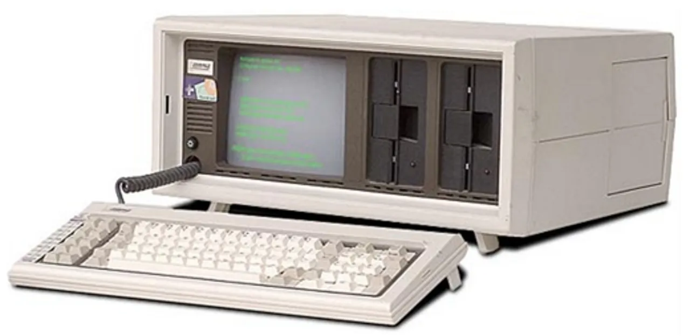

---

## Ano: 1983

- A Apple lança o computador Lisa, com o mouse
- A capacidade dos disquetes foi ampliada para 260 KB
- Aparecem os primeiros discos rígidos, com cerca de 10 MB de armazenamento

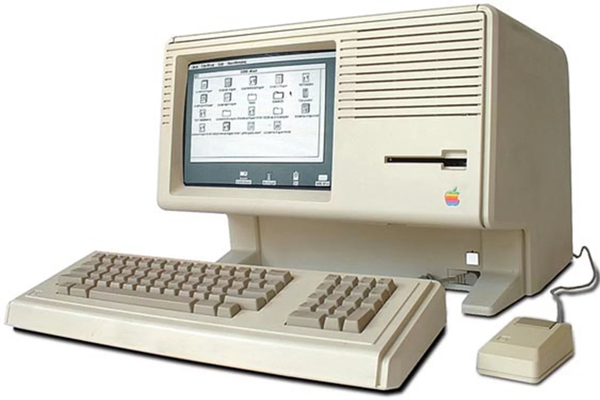

---

## Ano: 1984

- A Apple lança o Macintosh e uma interface mais amigável para o usuário, conhecida como GUI (Graphical User Interface), tecnologia desenvolvida pela Xerox
- Foram introduzidas as primeiras impressoras a laser, que permitiram fazer impressão com qualidade mais profissional

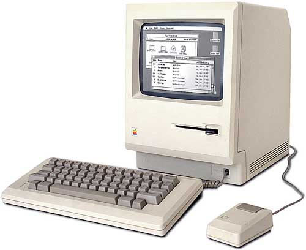

---

## Ano: 1985

- A Intel lança o microprocessador 80386, que inaugurou a era da computação de 32 bits na plataforma PC
- Lançamento de programas conhecidos como Desktop Publisher, que permitiam a confecção de páginas de publicações profissionais, entre eles o mais conhecido era o PageMaker

---

## Ano: 1986

- Os disquetes de 3½" (três polegadas e meia), então introduzidos para o Macintosh, estavam ficando populares
- A Microsoft utiliza desses disquetes na nova versão do DOS para PCs

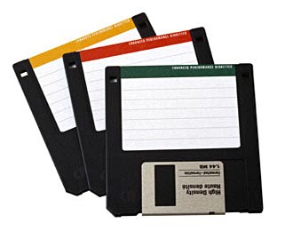

---

## Ano: 1987

- A Apple lança o Macintosh II, baseado na CPU Motorola 68020, com 1 MiB de memória RAM e disco rígido
- Vídeos gráficos no padrão VGA (Video Graphic Array) apareceram em IBM PCs

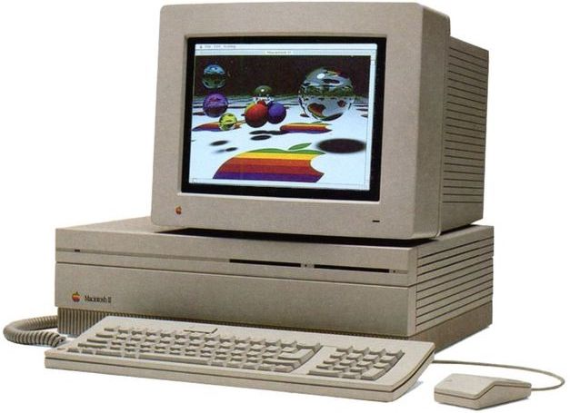

---

## Ano: 1988

- A Apple lança o Macintosh IIx com uma versão aperfeiçoada de CPU, o Motorola 68030 e com o coprocessador matemático 68882
- Na Internet surge o primeiro "Worm", um programa propagável automaticamente e nocivo. Diferente dos "vírus" não precisa de outro programa para se propagar

---

## Ano: 1989

- A Intel lança o microprocessador 80486 com um coprocessador matemático embutido e velocidades a partir de 25 MHz
- Disquetes DSHD (Double Side High Density) de 5¼", que têm dois lados, alta densidadee capacidade de 1.2 MB de armazenamento
- Grande crescimento de e-mail (Electronic Mail - Correio Eletrônico) como forma de comunicação entre usuários
- Vários modelos de Macintosh apareceram, entre eles, o Mac Portable, que contava com uma CPU Motorola 68000 de 16 MHz, 1 MiB de RAM e monitor LCD (Liquid Cristal Display) com exibição monocromática

---

## Ano: 1989

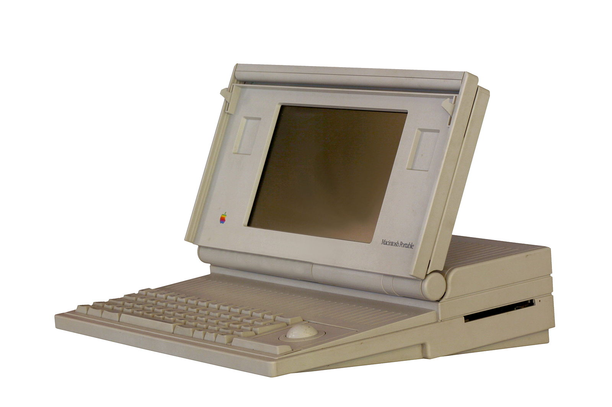

---

## Ano: 1990

- A Microsoft lança o Windows 3.0
- É lançado o microprocessador Motorola 68040

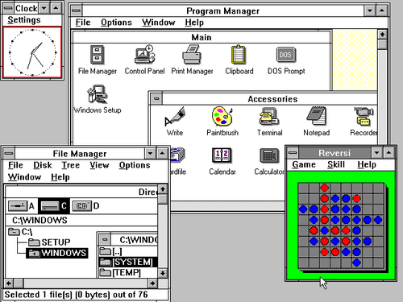

---

## Ano: 1991

- A Microsoft lança o MS-DOS 5.0, com algumas melhorias, como editor de texto em tela cheia, suporte para mais de dois discos rígidos, comandos que desfazem certas ações vitais da máquina
- A Apple lança o notebook Macintosh PowerBooks, que oferecia disco rígido embutido e fax/modem. Também são lançados o Macintosh Quadra e o Centris, baseados no Motorola 68040
- O estudante Linus Torvalds inicia o desenvolvimento do sistema operecional Linux
- Surge o TrackBall, dispositivo semelhante ao mouse

---

## Ano: 1992

- A Intel lança o microprocessador 80486DX2
- A Motorola anuncia o PowerPC
- A Microsoft lança o Windows 3.11 for WorkGroups com suporte a redes
- Os vírus se espalham pelo mundo. Em 1988, havia cinco vírus conhecidos. Em 1992, já havia mais de mil

---

## Ano: 1993

- A Intel lança o microprocessador Pentium, capaz de processar até 100 milhões de instruções por segundo
- A Microsoft desenvolve o Windows NT, plataforma para soluções em rede cliente/servidor

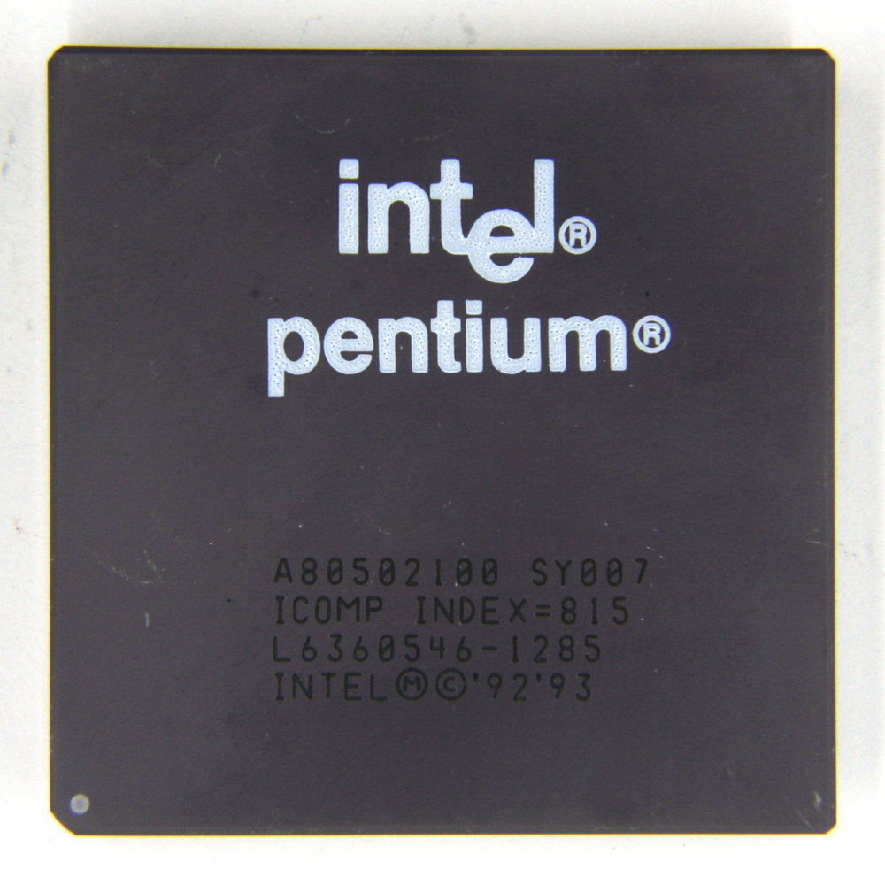

---

## Ano: 1994

- Foi apresentado o primeiro microprocessador PowerPC
- A IBM lançou o sistema operacional OS/2 Warp para competir com o Windows. O OS/2 Warp ofereceu uma interface amigável ao usuário, multitarefa e acesso fácil à Internet

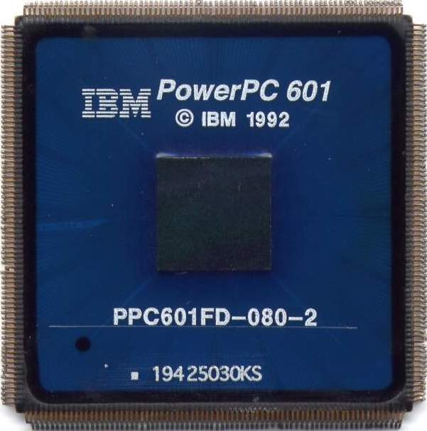

---

## Ano: 1995

- A Netscape se tornou a ferramenta de navegação na Internet, oferecendo carregamento rápido de dados, facilidade para lançar aplicações externas e enviar e-mails
- A Microsoft lança o Windows 95, um verdadeiro sistema multitarefa com capacidade de trabalho em redes e com menor dependência do DOS
- A Intel lança o microprocessador Pentium Pro

---

## Ano: 1995

---

## Ano: 1996

- A IBM lança o sistema operacional OS/2 Warp Server 4, que oferece gerenciamento de recursos de rede
- É lançado o padrão USB (Universal Serial Bus), que é uma conexão *plug and play* que permite a conexão de diversos periféricos compatíveis, sem precisar desligar o computador

---

## Ano: 1997

- A Intel lança o microprocessador Pentium MMX de 166 MHz e o Pentium II de 222 MHz
- A Cyrix lança o microprocessador 6x86MX PR222 para competir com o Intel Pentium MMX e Intel Pentium II
- A AMD lança o microprocessador AMD K6 para competir com o Intel Pentium II

---

## Ano: 1998

- A Microsoft lança o Windows 98. Sua maior novidade era a completa integração com a Internet, pois incorporava o navegador Internet Explorer 4
- A Intel lança o processador Pentium II Xeon para servidores e estações de trabalho

---

## Ano: 1998

---

## Ano: 1999

- A Intel lança os microprocessadores Celeron, Pentium III e Pentium III Xeon
- A AMD cria o microprocessador Athlon
- A Microsoft lança o Windows 98 SE para corrigir falhas e instabilidade do Windows 98, além de substituir o Internet Explorer 4 pelo Internet Explorer 5

---

## Ano: 2000

- A Intel lança o microprocessador Pentium 4
- A Microsoft lança o Windows 2000 Professional e o Windows Me
- A Apple lança o Mac OS X, sistema operacional baseado em Unix, com interface gráfica, destinado aos computadores Macintosh

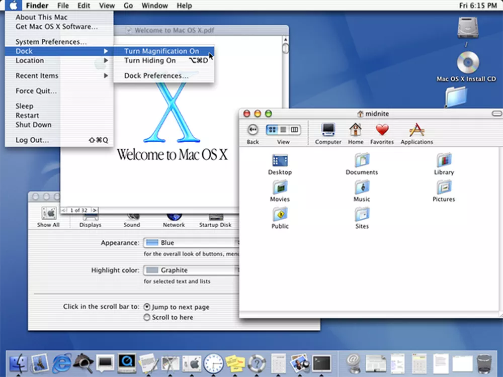

---

## Ano: 2001

- A Intel lança os processadores Xeon e Itanium
- A Microsoft lança o Windows XP, que visava unir a facilidade de uso do Windows Me e seus recursos multimídia com a estabilidade do Windows 2000

---

## Ano: 2002

- A distrbuidora do sistema operacional Linux Red Hat se instala no Brasil
- A Microsoft lança o Windows XP SP1 (Service Pack 1), que é um conjunto de correções e atualizações

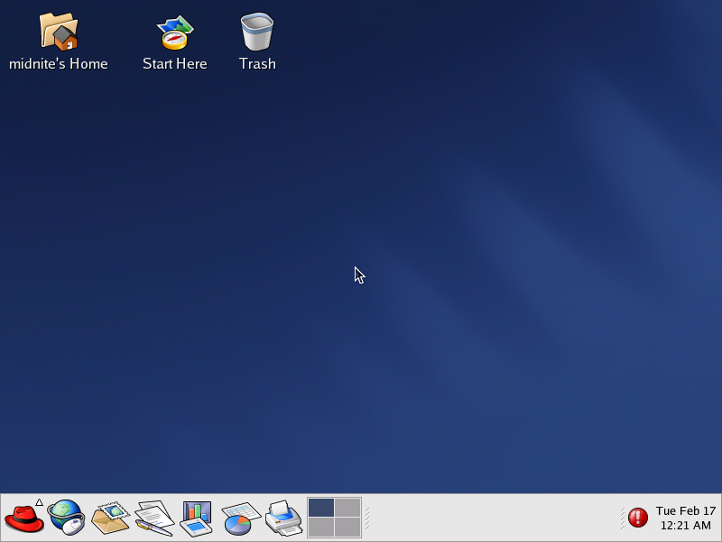

---

## Ano: 2003

- Surge o Worm Blaster, que infecta milhares de computadores
- Surge a technologia Multithreading que permite criar programas para executarem diferentes partes do código ao mesmo tempo

---

## Ano: 2004

- Lançamentos acontecem, todavia nenhum grande destaque para computadores e sistemas operacionais

---

## Ano: 2005

- A Apple anuncia a migração da plataforma PowerPC para processadores Intel
- A Microsoft anuncia que lançara um novo sistema operacional denominado Windows Vista, com lançamento previsto para 2006, mas adia para

---

## Ano: 2006

- Lançamentos acontecem, todavia nenhum grande destaque para computadores e sistemas operacionais
- Microsoft confirma lançamento do Windows Vista para 2007

---

## Ano: 2007

- Microsoft confirma o lançamento mundial simultâneo do Windows Vista e o do Microsoft Office 2007, seu pacote de aplicativos de escritório

---

## Ano: 2008

- A Apple lança o iPhone

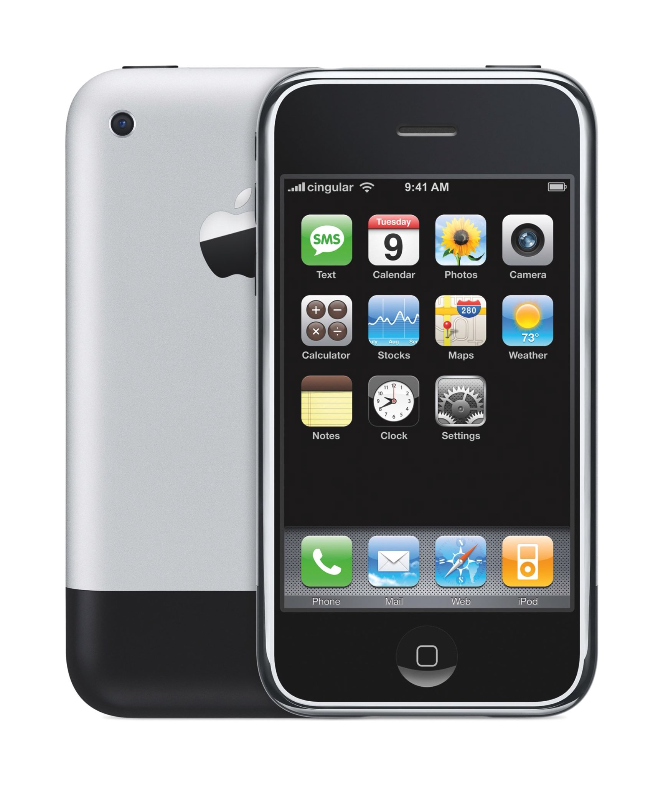

---

## Ano: 2009

- A Microsoft lança o Windows 7, cuja interface é muito semelhante ao Windows Vista, mas é muito mais rápido e com grandes melhorias na estrutura

---

## Ano: 2010

- A Apple lança o iPad, dispositivo na forma de prancheta, com funcionalidades de um smartphone e notebook
- A Microsoft lança o Microsoft Office 2010

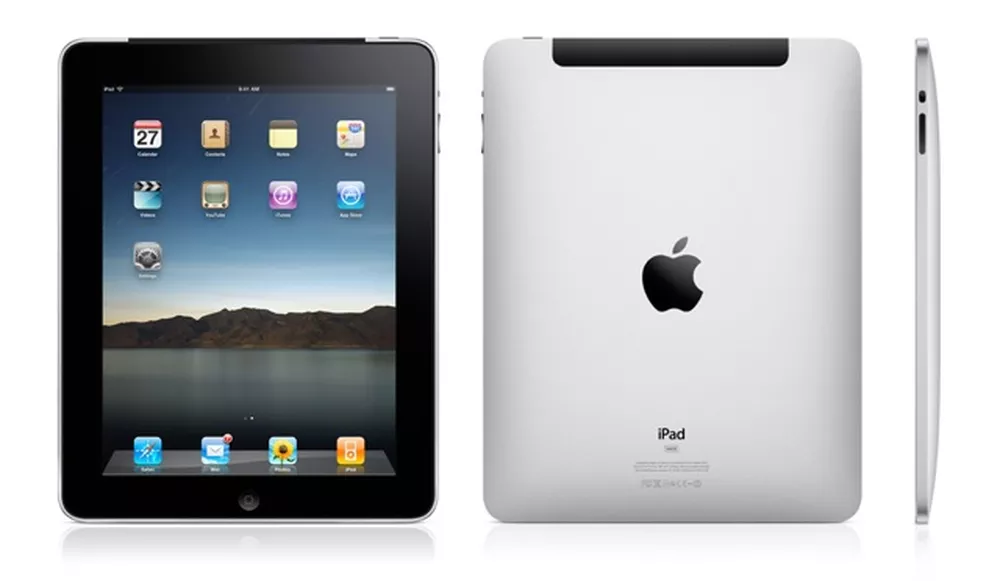

---

## Referências Bibliográficas

- MANZANO, Maria Izabel N.G. **Estudo Dirigido de Informática Básica**. 7ª. Edição. Ed. Érica, 2011. ISBN: 978-85-365-0128-4
- Ábaco
  - https://pt.wikipedia.org/wiki/%C3%81baco
  - https://pt.wikipedia.org/wiki/Ficheiro:Boulier1.JPG

---

## Referências Bibliográficas

- Ossos de Napier
  - https://pt.wikipedia.org/wiki/Ossos_de_Napier
  - https://assets.sutori.com/user-uploads/image/fe56fd6e-07d0-4474-91f5-920f75470abf/da59f95bed3b451bc103667b34b65db3.jpeg

---

## Referências Bibliográficas

- Régua de Cálculo
  - https://pt.wikipedia.org/wiki/R%C3%A9gua_de_c%C3%A1lculo
  - https://en.wikipedia.org/wiki/William_Oughtred
  - https://assets.sutori.com/user-uploads/image/9da21038-64c3-4558-8a2e-0e7782cf7b71/aadae5e5ab6d4ae6211e972556fb6c93.jpeg
  - https://upload.wikimedia.org/wikipedia/commons/f/f7/Circular_slide_rule.JPG

---

## Referências Bibliográficas

- Máquina de Schickard
  - https://pt.wikipedia.org/wiki/Wilhelm_Schickard
  - https://upload.wikimedia.org/wikipedia/commons/5/5a/Schickardmaschine.jpg
- La Pascaline
  - https://pt.wikipedia.org/wiki/La_pascaline
  - https://pt.wikipedia.org/wiki/Blaise_Pascal
  - https://upload.wikimedia.org/wikipedia/commons/8/80/Arts_et_Metiers_Pascaline_dsc03869.jpg

---

## Referências Bibliográficas

- Máquina de Leibniz
  - https://pt.wikipedia.org/wiki/Gottfried_Wilhelm_Leibniz
  - https://ca.wikipedia.org/wiki/Calculadora_de_Leibniz
  - https://upload.wikimedia.org/wikipedia/commons/thumb/0/0b/Rechenmaschine_von_Leibniz_%28Nachbau%29_09.jpg/2880px-Rechenmaschine_von_Leibniz_%28Nachbau%29_09.jpg

---

## Referências Bibliográficas

- Tear de Jacquard
  - https://pt.wikipedia.org/wiki/Joseph-Marie_Jacquard
  - https://upload.wikimedia.org/wikipedia/commons/thumb/b/b6/Jacquard_loom_p1040320.jpg/1280px-Jacquard_loom_p1040320.jpg
- Máquina Diferencial
  - https://pt.wikipedia.org/wiki/M%C3%A1quina_diferencial
  - https://dunapress.com/2019/03/24/maquina-diferencial-de-babbage/

---

## Referências Bibliográficas

- Máquina Analítica
  - https://pt.wikipedia.org/wiki/M%C3%A1quina_anal%C3%ADtica
- Augusta Ada Byron King (Ada Lovelace)
  - https://pt.wikipedia.org/wiki/Ada_Lovelace
  - https://upload.wikimedia.org/wikipedia/commons/0/0f/Ada_lovelace.jpg

---

## Referências Bibliográficas

- Máquina de Calcular Baldwin
  - https://en.wikipedia.org/wiki/Frank_Stephen_Baldwin
  - https://www.pinterest.de/pin/615163630328176075/
- George Boole
  - https://pt.wikipedia.org/wiki/George_Boole
  - https://upload.wikimedia.org/wikipedia/commons/c/ce/George_Boole_color.jpg

---

## Referências Bibliográficas

- Máquina de Tabular
  - https://pt.wikipedia.org/wiki/Tabuladora
  - https://upload.wikimedia.org/wikipedia/commons/thumb/4/4e/HollerithMachine.CHM.jpg/2560px-HollerithMachine.CHM.jpg
- Computômetro
  - https://es.wikipedia.org/wiki/Compt%C3%B3metro
  - https://upload.wikimedia.org/wikipedia/commons/3/3e/Comptometer_model_ST_Super_Totalizer.png

---

## Referências Bibliográficas

- Máquina de Odhner ou Arithmometer
  - https://en.wikipedia.org/wiki/Willgodt_Theophil_Odhner
  - https://upload.wikimedia.org/wikipedia/commons/5/57/Odhner_made_before_1900.jpg
- Mark I
  - https://pt.wikipedia.org/wiki/Harvard_Mark_I
  - https://pt.wikipedia.org/wiki/Harvard_Mark_I#/media/Ficheiro:Harvard_Mark_I_Computer_-_Right_Segment.JPG

---

## Referências Bibliográficas

- John Louis von Neumann
  - https://pt.wikipedia.org/wiki/John_von_Neumann
  - https://pt.wikipedia.org/wiki/Arquitetura_de_von_Neumann
  - https://upload.wikimedia.org/wikipedia/commons/5/5e/JohnvonNeumann-LosAlamos.gif

---

## Referências Bibliográficas

- Z1
  - https://pt.wikipedia.org/wiki/Konrad_Zuse
  - https://upload.wikimedia.org/wikipedia/commons/d/da/Konrad_Zuse_%281992%29.jpg
  - https://pt.wikipedia.org/wiki/Z1
  - https://upload.wikimedia.org/wikipedia/commons/e/e5/Zuse_Z1-2.jpg

---

## Referências Bibliográficas

- Z2
  - https://en.wikipedia.org/wiki/Z2_(computer)
  - https://upload.wikimedia.org/wikipedia/commons/0/01/Zuse_archive_Z2.jpg
- Z3
  - https://en.wikipedia.org/wiki/Z3_(computer)
  - https://upload.wikimedia.org/wikipedia/commons/4/4c/Z3_Deutsches_Museum.JPG

---

## Referências Bibliográficas

- Z4
  - https://pt.wikipedia.org/wiki/Z4
  - https://pt.wikipedia.org/wiki/Z4#/media/Ficheiro:Zuse-Z4-Totale_deutsches-museum.jpg

---

## Referências Bibliográficas

- Z5
  - https://blog.hnf.de/wp-content/uploads/2018/07/z5ganz.jpg
- Alan Turing
  - https://pt.wikipedia.org/wiki/Alan_Turing
  - https://cdn.britannica.com/81/191581-050-8C0A8CD3/Alan-Turing.jpg

---

## Referências Bibliográficas

- ENIAC
  - https://pt.wikipedia.org/wiki/ENIAC
  - https://upload.wikimedia.org/wikipedia/commons/thumb/6/6c/ENIAC_Penn1.jpg/2560px-ENIAC_Penn1.jpg
- Claude Shannon
  - https://pt.wikipedia.org/wiki/Claude_Shannon
  - https://upload.wikimedia.org/wikipedia/commons/9/99/ClaudeShannon_MFO3807.jpg

---

## Referências Bibliográficas

- Primeira Geração
  - https://upload.wikimedia.org/wikipedia/commons/e/e9/Elektronenroehren-auswahl.jpg
- Ano: 1971
  - https://upload.wikimedia.org/wikipedia/commons/5/52/Intel_4004.jpg
- Ano: 1974
  - https://www.old-computers.com/museum/photos/Mark8_Minicomp_System_1.jpg

---

## Referências Bibliográficas

- Ano: 1975
  - https://upload.wikimedia.org/wikipedia/commons/8/8b/CPU_Altair_8800.jpg
- Ano: 1976
  - https://s2.glbimg.com/uSqkVUQcqHka01qmnhs3GwnEldA=/0x0:620x388/1000x0/smart/filters:strip_icc()/i.s3.glbimg.com/v1/AUTH_08fbf48bc0524877943fe86e43087e7a/internal_photos/bs/2021/q/U/98BtV5R0K9pu2WBlMKQw/2011-08-25-apple-i.jpg

---

## Referências Bibliográficas

- Ano: 1977
  - https://s2.glbimg.com/9UqXYZX0PnohlCeFfN1mv4Lnnjw=/0x0:695x398/1000x0/smart/filters:strip_icc()/i.s3.glbimg.com/v1/AUTH_08fbf48bc0524877943fe86e43087e7a/internal_photos/bs/2021/j/D/LgEUr5TAes9pM4tIANRg/2016-04-01-apple-ii.jpg
- Ano: 1979
  - https://upload.wikimedia.org/wikipedia/en/e/e3/Wordstar_Screenshot.png
  - https://upload.wikimedia.org/wikipedia/commons/7/7a/Visicalc.png

---

## Referências Bibliográficas

- Ano: 1980
  - https://duet-cdn.vox-cdn.com/thumbor/0x0:1920x1280/1200x800/filters:focal(968x143:969x144):format(webp)/cdn.vox-cdn.com/uploads/chorus_asset/file/13277951/billgatesypaulallen.jpg
- Ano: 1981
  - https://upload.wikimedia.org/wikipedia/commons/6/69/IBM_PC_5150.jpg

---

## Referências Bibliográficas

- Ano: 1982
  - https://www.zdnet.com/a/img/resize/11d0ae275962ff3ec4a494fb1f9fff9ae8f88a75/2014/10/05/57c0c06c-4c40-11e4-b6a0-d4ae52e95e57/compaq-portable.jpg?auto=webp&width=1280
- Ano: 1983
  - https://tm.ibxk.com.br/2017/12/27/27160545840020.jpg
- Ano: 1984
  - https://macmagazine.com.br/wp-content/uploads/2009/11/02-Macintosh-1984.jpg

---

## Referências Bibliográficas

- Ano: 1985
  - https://pt.wikipedia.org/wiki/Intel_80386
  - https://upload.wikimedia.org/wikipedia/commons/0/04/KL_Intel_i386DX.jpg
- Ano: 1986
  - https://www.cursosdeinformaticabasica.com.br/wp-content/uploads/2013/05/disquetes.jpg

---

## Referências Bibliográficas

- Ano: 1987
  - https://www.opovo.com.br/noticiasimages/app/noticia_146418291334/2017/03/02/264099/macintosh-ii.jpg
- Ano: 1989
  - https://upload.wikimedia.org/wikipedia/commons/thumb/c/c3/Macintosh_Portable-IMG_7541.jpg/1599px-Macintosh_Portable-IMG_7541.jpg

---

## Referências Bibliográficas

- Ano: 1993
  - https://upload.wikimedia.org/wikipedia/commons/7/77/Ic-photo-Intel--A80502100--%28Pentium-CPU%29.JPG
- Ano 1995
  - https://upload.wikimedia.org/wikipedia/pt/9/90/Am_windows95_desktop.png
- Ano 1998
  - https://upload.wikimedia.org/wikipedia/pt/0/00/Windows98.png

---

## Referências Bibliográficas

- Ano: 2000
  - https://s2.glbimg.com/Edid_k73Ux2iR9kAuoEyovpWxCI=/0x0:620x465/1000x0/smart/filters:strip_icc()/i.s3.glbimg.com/v1/AUTH_08fbf48bc0524877943fe86e43087e7a/internal_photos/bs/2021/J/j/Ylox0BSIiEahZRVYoutA/2012-04-19-03.png
- Ano: 2001
  - https://upload.wikimedia.org/wikipedia/pt/8/8f/Windows_XP_SP3.png

---

## Referências Bibliográficas

- Ano: 2002
  - https://upload.wikimedia.org/wikipedia/commons/7/71/GNOME_2.2_on_Red_Hat_Linux_9_--_2003-02.png
- Ano: 2008
  - https://pbs.twimg.com/media/DDgLS6JUMAEvsV8.jpg:large

---

## Referências Bibliográficas

- Ano: 2010
  - https://s2.glbimg.com/LTEEPaEIpWkuUbwq9eLAZWwJUDM=/0x0:640x372/1000x0/smart/filters:strip_icc()/i.s3.glbimg.com/v1/AUTH_08fbf48bc0524877943fe86e43087e7a/internal_photos/bs/2021/h/D/ZK62BMTNefxLAOY5yBNg/2013-07-23-apple-ipad.jpg