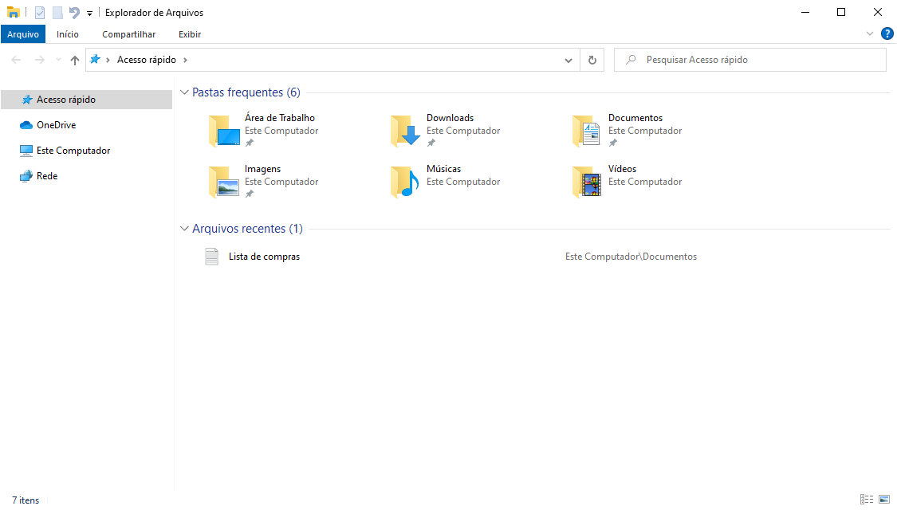
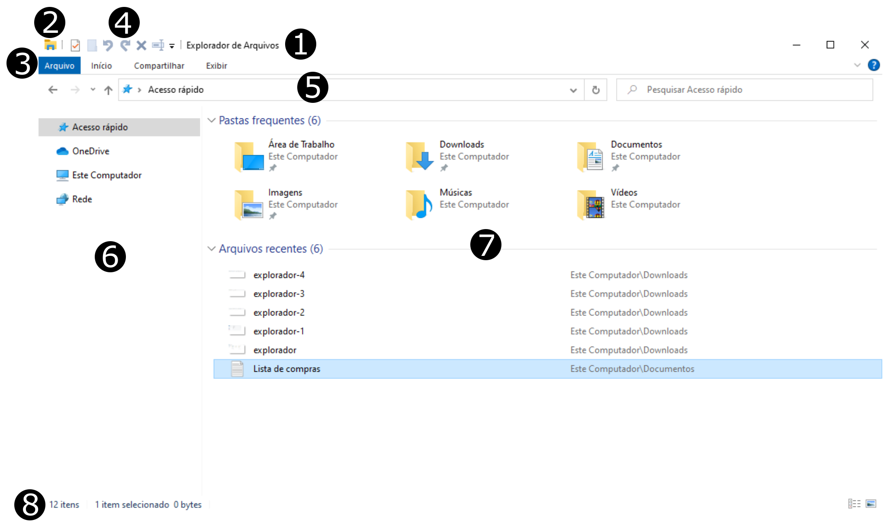
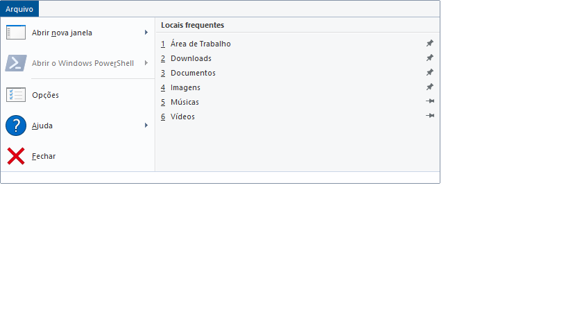
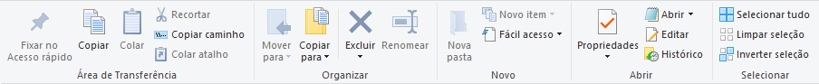
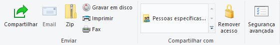
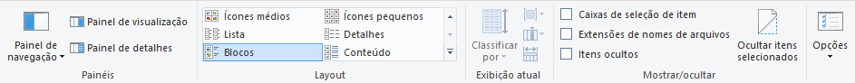
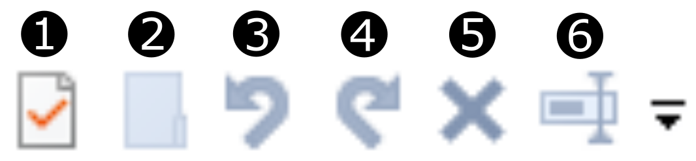

<!-- _paginate: false -->
# **Fundamentos de Informática e Aplicativos**

## Capítulo 3 - Explorador de Arquivos

---

## Explorador de Arquivos (Windows Explorer)

- Programa para gerenciar a estrutura de pastas, arquivos, atalhos e unidades de armazenamento disponíveis no computador

---

## Ambiente do Explorador de Arquivos

---

## Ambiente do Explorador de Arquivos

1. **Barra de Título**: exibe o nome do programa e da pasta acessada a medida que a selecionamos
2. **Caixa de Controle**: acessa as opções restaurar, mover, tamanho, minimizar, maximizar e fechar
3. **Faixa de Opções**: exibe os botões relativos aos menus Arquivo, Início, Compartilhar e Exibir
4. **Barra de Ferramentas de Acesso Rápido**: exibe os botões para as tarefas mais frequentes

---

## Ambiente do Explorador de Arquivos

5. **Barra de Endereços**: exibe o endereço do item acessado e permite o deslocamento para outros locais
6. **Painel de Navegação**: exibe a lista de pastas e unidades para navegação
7. **Lista do Conteúdo das Pastas e Unidades**: exibe o conteúdo da pasta ou unidade selecionada no painel de navegação
8. **Barra de Status**: exibe informações sobre os itens selecionados, como por exemplo, número de itens da pasta ativa, número de itens selecionados, tamanho da seleção e modos de exibição da janela (Detalhes e Miniaturas)

---

## Faixas de Opções: Arquivo

---

## Faixas de Opções: Início

---

## Faixas de Opções: Compartilhar

---

## Faixas de Opções: Exibir

---

## Barra de Ferramentas de Acesso Rápido

1. **Propriedades**: mostra as propriedades do item selecionado
2. **Nova Pasta**: cria uma nova pasta no lugar atual
3. **Desfazer**: desfaz uma determinada ação
4. **Refazer**: refaz a ação cancelada pelo botão Desfazer
5. **Excluir**: exclui o item selecionado
6. **Renomear**: altera o nome do item selecionado

---

## Barra de Endereços

1. **Voltar**
2. **Avançar**
3. **Acima**
4. **Barra de Endereços**
5. **Atualizar**
6. **Barra de Pesquisa**

---

## Atalhos de Teclado

| Atalho           | Ação                                              |
|------------------|---------------------------------------------------|
| Ctrl + F         | Selecionar a caixa de pesquisa                    |
| Ctrl + N         | Abrir uma nova janela                             |
| Ctrl + W         | Fechar a janela atual                             |
| Ctrl + Shift + E | Exibir todas as pastas acima da pasta selecionada |
| Ctrl + Shift + N | Criar uma nova pasta                              |
| Alt + P          | Exibir o painel de visualização                   |

---

## Atalhos de Teclado

| Atalho                     | Ação                                     |
|----------------------------|------------------------------------------|
| Alt + Enter                | Propriedades do item selecionado         |
| Alt + Seta para a direita  | Exibir a próxima pasta                   |
| Alt + Seta para a esquerda | Exibir a pasta anterior                  |
| Alt + Seta para cima       | Exibir a pasta na qual esta pasta se encontra |

---

## Atalhos de Teclado

| Atalho                     | Ação                                     |
|----------------------------|------------------------------------------|
| Seta para a direita        | Exibe as subpastas da pasta selecionada  |
| Seta para a esquerda       | Recolhe as subpastas da pasta selecionada|
| Ctrl + C                   | Copiar                                   |
| Ctrl + V                   | Colar                                    |
| Ctrl + X                   | Recortar (Mover)                         |
| Ctrl + A                   | Selecionar tudo                          |

---

## Atalhos de Teclado

| Atalho                     | Ação                                     |
|----------------------------|------------------------------------------|
| Shift + Delete             | Apagar sem enviar para a lixeira         |
| Alt + F4                   | Fechar o programa                        |
| F2                         | Renomear                                 |

---

## Referências Bibliográficas

- Ewandro Lima, **Introdução a Informática - Windows 10 (Aula 4)**, https://www.uba.mg.leg.br/escola-do-legislativo/curso-preparatorio-para-o-concurso-da-prefeitura-de-uba/aula-4-introducao-a-informatica-windows-10-15-12-2021.pdf, acessado em 09/03/23